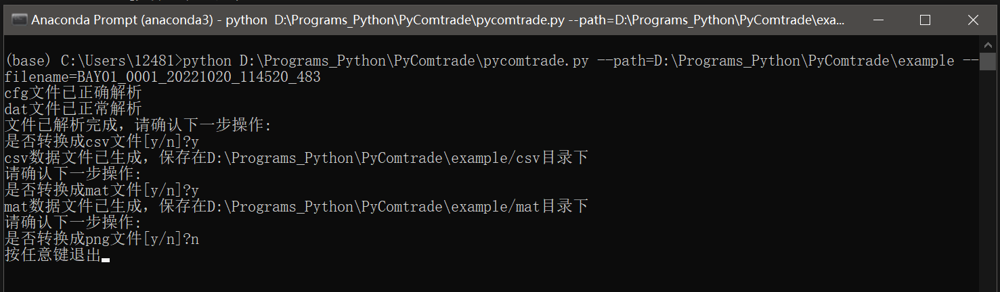

# PyComtrade

读取 `Comtrade` 数据格式文件，并将其转换成 `csv`、`mat`、`png` 等数据格式。其中 `Comtrade` 数据格式参考[COMTRADE文件格式详解](https://blog.csdn.net/Mr_robot_strange/article/details/121905288)。

## 项目结构

```tex
PyComtrade
    │  .gitignore  % git忽略文件
    │  multi_process.py  % 批量处理示例文件
    │  PyComtrade.py  % comtrade数据转换主程序
    │  README.md  % 说明文档
    │  requirements.txt  % 运行依赖库
    │
    ├─doc  % 帮助文档
    │      README.pdf
    │
    ├─example  % 示例数据
    │  │  BAY01_0001_20221020_114520_483.cfg  % 示例cfg文件
    │  │  BAY01_0001_20221020_114520_483.dat  % 示例dat文件
    │  │
    │  ├─csv  % 示例数据转换后的csv文件
    │  │
    │  ├─mat  % 示例数据转换后的mat文件
    │  │
    │  └─png  % 示例数据转换后的png文件
    │
    └─README.assets  % 说明文档f
            image-20230227150618430.png
```


## 使用方法

> 假设：`PyComtrade.py` 文件存储于目录：`D:\Programs_Python\PyComtrade` ，`Comtrade`数据文件存储在目录 `D:\Programs_Python\PyComtrade\example` ，其中至少包含 `BAY01_0001_20221020_114520_483.cfg` 和 `BAY01_0001_20221020_114520_483.dat` 两个文件。

进入 `cmd` 命令行（推荐采用 anaconda prompt），进入相关环境后，输入：

```shell
python <D:\Programs_Python\PyComtrade>.py --path=<D:\Programs_Python\PyComtrade\example> --filename=<BAY01_0001_20221020_114520_483>
```

注意，上面代码中 `<>` 内的内容是按照假设条件输入的，使用时更换为你自己的路径。其中参数`--filename=`应当不加任何`.cfg`及`.dat`后缀名。

如果正确输入，将会出现：

```
cfg文件已正确解析
dat文件已正常解析
```

之后，将进行转换工作。如需要转换成 csv 文件，在命令：

```
文件已解析完成，请确认下一步操作:
是否转换成csv文件[y/n]?
```

后输入 `y` 即可，随后显示 `csv数据文件已生成，保存在D:\Programs_Python\PyComtrade\example/csv目录下` ，说明转换成功；如输入 `n` ，则自动跳过这一转换。

其他类型的转换同理。

最后，按任意键结束程序运行。

整体示例如下图：



## 更新日志

#### V3.0 

采用命令行进行交互，便捷操作；

提供批量转换的示例程序，可用于处理大批量 `Comtrade` 文件。

#### V2.1

通过 `ComtradeFile.save_mat()` 方法将 `Comtrade` 文件导出为 `.mat` 文件，可直接导入在 MATLAB 中，做后续分析。

#### V2.0

通过 `ComtradeFile.save_csv()` 方法将 `Comtrade` 文件转换成 `csv` 数据格式。该格式通用性较强，可在多种软件中导入。

通过 `ComtradeFile.save_png()` 方法将 `Comtrade` 文件转显示为 `png` 图片。

## 注意事项
1. 对于采样频率，注意同一组数据在不同的部分可能采样频率是不一样的，具体采样频率的值仍需要参考`cfg`文件获取。
2. `mat`文件在读入MATLAB时，如果直接双击打开，可能会出错。保险的做法是将`mat`文件放入MATLAB当前文件夹中，用`load`函数加载。
2. 如果遇到环境依赖问题，可按照文件 自行配置，推荐采用 anaconda 进行配置

## 链接

项目地址：

[GitHub](https://github.com/VicoZhang/PyComtrade.git)

[Gitee](https://gitee.com/vico_zhang/PyComtrade.git)

如果发现程序存在运行错误或者有更好的完善建议，欢迎做出修改~~
